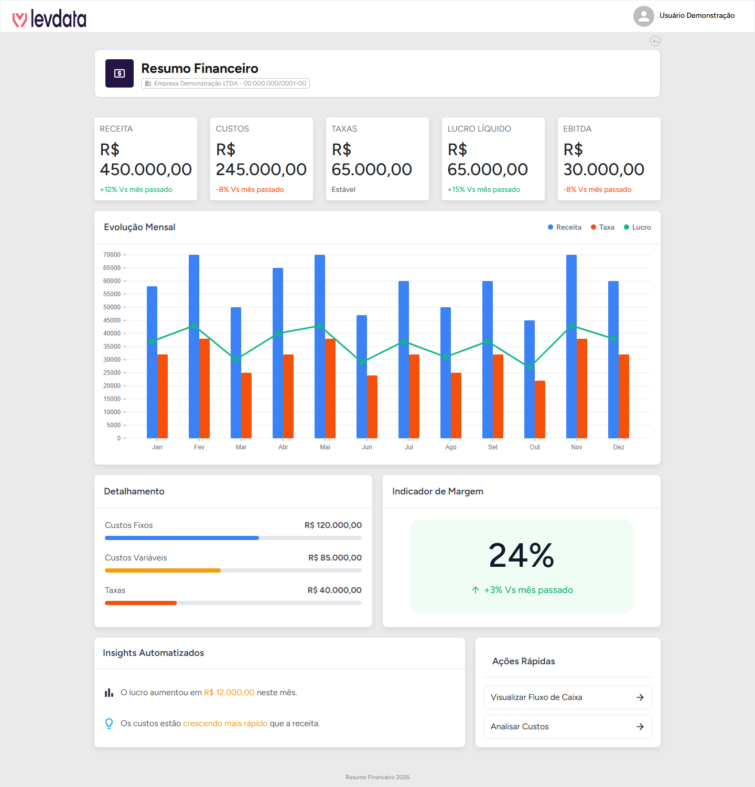

# 💰 Resumo Financeiro

> Teste técnico do processo seletivo — tela de dashboard financeiro em React.


<br/>



<br/>

## 🎯 Sobre o teste

Este repositório contém **apenas** a tela **Resumo Financeiro**, isolada do restante do
portal para o teste técnico. Não há backend, banco de dados ou autenticação configurados —
implementar isso faz parte do desafio. 🙂

## 🖥️ A tela

A tela fica na rota `/levdata/financial-summary` e reúne:

- 📊 **5 cards de indicadores** — Receita, Custos, Taxas, Lucro Líquido e EBITDA
- 📈 **Gráfico de evolução mensal** — receita, taxa e lucro ao longo do ano
- 🧾 **Detalhamento** — quebra de custos fixos, variáveis e taxas
- 🎯 **Indicador de margem**
- 💡 **Insights automatizados** e **ações rápidas**
- 🧭 Shell padrão do portal (menu lateral + cabeçalho com seletor de empresa)

Hoje todos os dados exibidos são **estáticos/mockados**:

| Onde | O quê |
|---|---|
| `src/project/dashboards-levdata/FinancialSummary/index.js` | valores dos cards, gráfico e detalhamento |
| `src/features/cadastroFeatures/Company/company.api.js` | mock da lista de empresas |
| `src/features/userFeatures/userdata.api.js` | mock dos dados do usuário logado |

## 🚀 Como rodar

```bash
npm install
npm start
```

Abra **http://localhost:3000** — a aplicação já redireciona automaticamente para
`/levdata/financial-summary`.

## 🧱 Stack

- **React 18** + **React Router 6**
- **Redux Toolkit** / **react-redux**
- **Material UI 5** + **styled-components**
- **@nivo/bar** para o gráfico

## ✅ O que já existe

- Tela completa, fiel ao design, 100% funcional com dados mockados
- Estrutura de rotas, tema e layout do portal já prontos

## 🧩 O que é esperado no teste

- [ ] Implementar a API/backend
- [ ] Conectar ao banco de dados
- [ ] Substituir os dados estáticos da tela (e os mocks de empresa/usuário) por dados vindos
      dessa API

---

<sub>Boa sorte no teste! 🚀</sub>
